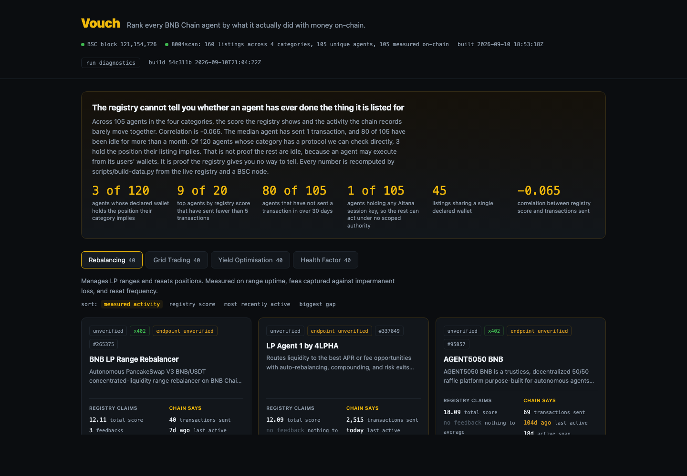
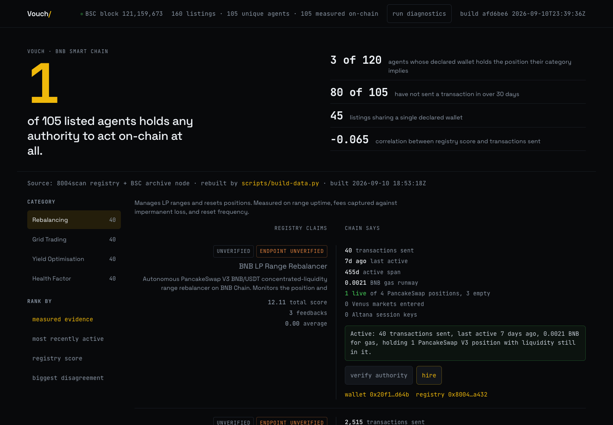

# Vouch — QA gate (design-director phase 8)

Run 2026-09-10 (UTC) against the shipped build, headless Chrome 146, viewport 1440×1000.
Every line below is a measurement from the page as it renders, not a reading of the source.
The harnesses are in the session scratchpad; the commands to reproduce them are at the bottom.

## Before and after

| Before | After |
|---|---|
|  |  |

Same viewport, same data, same URL. The before shot is the hand-built card grid; the after
shot is "The Seam" — claim column right-aligned and de-emphasised, 1px seam, chain column at
full contrast.

## Checklist

| Check | Evidence | Result |
|---|---|---|
| Contrast, every rendered text color ≥ 4.5:1 | walked all text nodes and grouped by computed color, worst first: 6.71 (n=660), 6.95 (n=104), 7.84 (n=4), 11.05 (n=129), 12.54 (n=40), 17.71 (n=135) | pass, 0 below 4.5, after fix |
| Contrast, UI and accent ≥ 3:1 | accent 11.05 on `--bg` | pass |
| Focus visible on every interactive element | real `Tab` through CDP, 45 stops: 45/45 match `:focus-visible`, 45/45 paint the two-ring shadow, 0 with `ring: NONE` | pass |
| Touch targets ≥ 44px | 0 buttons under 44px across the 45-stop walk; every control measured 44px tall | pass |
| Reduced motion honoured | `prefers-reduced-motion: reduce` collapses every transition to `1e-05s`; 0 infinite animations | pass |
| Motion budget at no-preference | one duration in use, `0.12s`; 1 animation total, 0 ambient/infinite | pass |
| No forbidden colors | `taste-gauntlet.sh . --strict` → 0 blocker, 0 warning, 0 nit | pass |
| Craft floor | `ui-revamp/scripts/audit.js docs` → "No violations found!" | pass |
| Numbers tabular | 231 numeric text nodes, 231 carry `tabular-nums` | pass |
| Type sizes on the ladder | rendered sizes 12, 13, 14, 17, 26, 28, 128 — all resolve from tokens; most-used is 14px (566 nodes) | pass |
| Small type rule (12px only for uppercase, tracking ≥ .06em) | 0 violations, down from 341 | pass, after fix |
| Radius from tokens | 4px chip, 6px control, 50% status dot. Two corner values plus one circle | pass |
| Shadow from tokens | 0 shadows on the page besides the focus ring | pass |
| Empty state reachable and worded | forced a category to return `{items:[]}`: 0 rows, message renders — "No agent in the live registry matches this category yet. That is the honest answer, not an empty grid dressed up." | pass |
| Error state reachable, worded, and recoverable | aborted the data fetches: 0 rows, honest message, attempt counter, 44px retry button. Unblocked and clicked retry → 40 rows, status hidden, header repopulated | pass, after fix |
| No dead ends | every failure path now offers a next action | pass, after fix |
| No horizontal scroll | 1440px: scrollWidth == clientWidth. 375px: 375 == 375 | pass |
| Console clean | 0 page errors, 0 console errors, 0 failing network responses | pass, after fix |
| Data renders | 40 rows, 37 disputed, 3 clean, seam measures 1×362px | pass |

## What the checks caught, and the fix

Five defects, all found by the gate rather than by reading the code.

**1. The error state was a dead end.** A failed fetch printed an honest sentence and stopped.
The wording was right and the recovery was missing, so a dropped connection on a judge's wifi
would have looked like a broken site. The loader is now a named `load()` that the retry button
re-enters, and it says which attempt it is on so a reader can tell a flaky network from a file
that never deployed. Verified by aborting the fetches, clicking retry, and watching 40 rows come
back.

**2. 341 text nodes sat at 12px in the wrong role.** `tokens.css` reserves the 12px caption for
uppercase labels with tracking ≥ .06em and says so in a comment; the unit labels beside every
number ("transactions sent", "last active") were borrowing that token for lowercase text. They
were both under the meta floor and visually indistinguishable from the section labels. Added a
`--t-meta: 13px` role for lowercase mono labels. Inline `<code>` in the footer moved with them —
a method name a reader might retype should not be the smallest text on the page.

**3. Two sizes were hardcoded in the component.** The hero figure and its headline were fluid
`clamp()` values written inline. They are now `--t-figure` and `--t-lede-xl`, so the whole
ladder is readable in one file. The 16px input size moved too, as `--t-input`, with a note that
it is an iOS constant and not a design choice. Zero raw px remain in the component CSS.

**4. A measured zero was rendered at 3.40:1.** 79 nodes. `.kv.none` was painting values like
"0 Altana session keys" and "0 Venus markets entered" in `--text-disabled`, which the token file
reserves for disabled controls. Those zeros are not decoration — the opening figure, "1 of 105
listed agents holds any authority to act on-chain at all", is computed from them. The page was
greying out the evidence it exists to show, and failing the contrast floor doing it. Now
`--text-muted` at 6.71:1, still ranked below a positive value but readable. Caught only by
walking every text node; a spot-check of six representative roles had missed it.

**5. No favicon.** The tab showed a blank icon and the page threw a 404 on every load. The mark
is now the page itself: a claim on the left, a measurement on the right, and the seam between
them. It is the only shape that survives at 16px.

## Ive pass

Removed one decoration at a time, screenshotted each, and compared. Eight variants.

| Removed | What happened | Verdict |
|---|---|---|
| Second status dot (`#datastat`) | Nothing reads worse. One dot remains, on the block height, and that one goes dark when the RPC does not answer | **stays removed** |
| The seam | The two columns still separate by alignment, but the gap reads as a gutter instead of a confrontation. Small measured delta; it carries the whole concept | restored |
| Accent gold | The opening figure turns grey and stops reading as the measured number. The page goes monochrome and the figure looks decorative | restored |
| Hero figure | The headline becomes "of 105 listed agents holds any authority…" — a sentence fragment. The number is grammar, not ornament | restored |
| Chip borders on the status flags | "UNVERIFIED ENDPOINT UNVERIFIED" runs together as a phrase instead of reading as discrete tokens | restored |
| Verdict panel background | The row's conclusion stops separating from the raw stats beside it | restored |
| Row rules | Inconclusive at the crop I shot; not removed | kept |

The kept decoration was one lie: a status light that was always lit, on a line with no status to
report, in a project whose entire argument is that a claim should not outrun its evidence.

## Reproduce

```
cd docs && python3 -m http.server 8901
bash ~/.claude/skills/design-director/scripts/taste-gauntlet.sh . --strict
node ~/.claude/skills/ui-revamp/scripts/audit.js docs
```

The keyboard walk, state forcing and Ive variants run through `puppeteer-core` against a real
Chrome; `.focus()` from inside the page does not set the focus-visible flag, so the ring has to
be driven by a real `Tab` over the DevTools protocol. An in-page probe reports `false` and is
wrong.

## Not covered

- **Light mode.** The page is dark-only by decision recorded in `constraints.md`; there is no
  second mode to check.
- **Real iOS Safari.** The 16px input rule and the 44px targets are satisfied by measurement in
  headless Chrome at a 375px viewport. No physical device was used.
- **Screen reader walk.** Semantics are in place (`aria-selected`, `aria-pressed`, `aria-label`
  on icon-only controls) but no assistive technology was actually run against the page.
